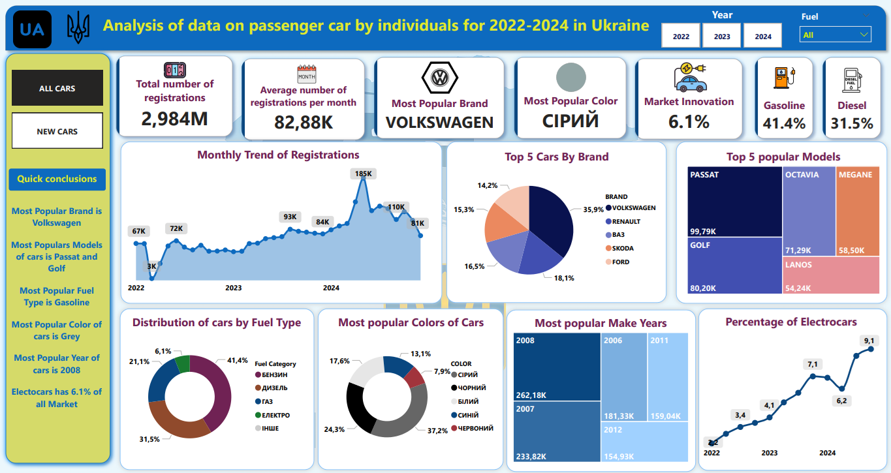
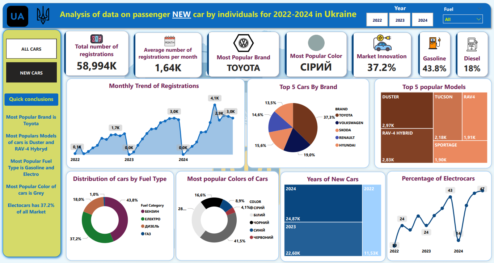

# 🔍 Аналіз реєстрацій легкових транспортних засобів фізичними особами в Україні (2022–2024 роки) 

Проєкт із створення повноцінного аналітичного дашборду із відкритих даних.

---

## 📂 Зміст

- [📌 Опис проєкту](#опис-проєкту)
- [📁 Дата-профайлінг](#дата-профайлінг)
- [🔧 Обробка даних у Python](#обробка-даних-у-python)
- [🧹 Фільтрація та оптимізація у PostgreSQL](#фільтрація-та-оптимізація-у-postgresql)
- [📊 Візуалізація та KPI](#візуалізація-та-kpi)
- [📅 Висновки](#висновки)
- [📂 Файли](#файли)

---

## 📌 Опис проєкту

Даний проєкт присвячено аналітиці державних відкритих даних щодо **реєстрації легкових транспортних засобів фізичними особами в Україні за 2022–2024 роки**.

Мета:

- зібрати, очистити й об’єднати дані;
- здійснити аналіз найпоширеніших брендів, моделей, кольорів авто, типів пального, обсягів двигунів тощо;
- візуалізувати результати у вигляді інтерактивного дашборду в Power BI;
- надати висновки по отриманим результатам;

---

## 📁 Дата-профайлінг

| Колонка        | Опис                                                                |
| -------------- | ------------------------------------------------------------------- |
| `PERSON`       | Тип власника ("P" = фізична особа)                                  |
| `D_REG`        | Дата реєстрації                                                     |
| `BRAND`        | Бренд автомобіля                                                    |
| `MODEL`        | Модель автомобіля                                                   |
| `MAKE_YEAR`    | Рік виготовлення авто                                               |
| `COLOR`        | Колір транспортного засобу                                          |
| `KIND`         | Вид транспорту (наприклад, "ЛЕГКОВИЙ")                              |
| `BODY`         | Тип кузова (седан, хетчбек, універсал і т.д.)                       |
| `FUEL`         | Тип пального (бензин, дизель, газ, електро тощо)                    |
| `CAPACITY`     | Об’єм двигуна, см³                                                  |
| `OWN_WEIGHT`   | Власна вага авто, кг                                                |
| `modified_vin` | Унікальний VIN, створений вручну для записів із VIN = 0 або дублями |

---

## 🔧 Обробка даних у Python

Набір даних, що буде використовуватись для аналізу, отримуємо із Порталу Відкритих даних ([https://data.gov.ua/](https://data.gov.ua/)) в розділі Відомості про транспортні засоби та їх власників. \
Для Аналізу буду використовувати інформацію про реєстраційні дії із транспортними засобами за 2022 та 2024 роки.\
Попередньо проаналізувавши дані та ознайомившись з ними, виявив ряд проблем, які потрібно вирішити перед їх загрузкою в PostgreSQL. \
Тому вирішив обробити наявні набори даних, використовуючи Python (та за допомогою ChatGPT), в ході чого виправив наступні помилки:

- в наборі даних були порожні клітинки, а PostgreSQL не любить працювати із таким, тому вирішив їх замінити на 0;

- в колонках із обємом двигуна, власною і загльною вагою деякі значення були введені через ",", а не через кому ".", тому теж здійснено їх редагування;

- всі 3 файли за 3 роки обєднано в один файл;\
  Файли були загружені в Google Drive перед тим. 

Обробка здійснювалась у Google Colab. Основні кроки:

```python
from google.colab import drive
import pandas as pd

drive.mount('/content/drive')

file_paths = [
    "/content/drive/My Drive/tz_opendata_z01012024_po01012025.csv",
    "/content/drive/My Drive/tz_opendata_z01012023_po01012024.csv",
    "/content/drive/My Drive/tz_opendata_z01012022_po01012023.csv"
]

columns_to_fix = ["CAPACITY", "OWN_WEIGHT", "TOTAL_WEIGHT"]
dataframes = []

for path in file_paths:
    df = pd.read_csv(path, encoding='utf-8', delimiter=';')
    df.fillna(0, inplace=True)
    for col in columns_to_fix:
        if col in df.columns:
            df[col] = df[col].astype(str).str.replace(',', '.').astype(float)
    dataframes.append(df)

combined_df = pd.concat(dataframes, ignore_index=True)
processed_file_path = "/content/drive/My Drive/combined_processed_data.csv"
combined_df.to_csv(processed_file_path, index=False, encoding='utf-8')
```

📅 Після об’єднання отримаємо **6 215 184** записів.

---

## 🧹 Фільтрація та оптимізація у PostgreSQL

Оскільки отриманий набір даних містить більше 6 мільйонів записів, я вирішив здійснити деяку його фільтрацію та оптимізацію і зменшити обєм даних для аналізу.\
Також після попреднього етапу було багато рядків, де він-код авто був 0 (до того були пусті значення). 

За допомогою SQL я здійснив:

- надав кожному рядку номер;
- зробив унікальні він-коди для для рядків з він кодом "0";
- обрав лише останню реєстраційну дію, де він код повторювався;
- обрав лише колонки, які будуть використані для аналізу;
- здійснив фільтрацію по: лише фізичні особи, тип авто - легкові, тип палива - не відсутній;\
  Для зменшення обсягу даних до опрацювання використано SQL:

```sql
WITH temp_table AS (
  SELECT *, ROW_NUMBER() OVER () AS row_num FROM cars_ua_2024
),
new_vin AS (
  SELECT *,
         CASE
            WHEN "VIN" = '0' THEN CONCAT("VIN", '_', row_num)
            ELSE "VIN"
         END AS modified_vin
  FROM temp_table
),
final_table AS (
  SELECT DISTINCT ON (modified_vin) *
  FROM new_vin
  ORDER BY modified_vin, "D_REG" DESC
)
SELECT "PERSON", "D_REG", "BRAND", "MODEL", "MAKE_YEAR", "COLOR",
       "KIND", "BODY", "FUEL", "CAPACITY", "OWN_WEIGHT", modified_vin
FROM final_table
WHERE "PERSON" = 'P'
  AND "KIND" = 'ЛЕГКОВИЙ'
  AND "FUEL" != '0';
```

🔄 Залишилось **2 983 519** записів.

🎲 Дублікати по VIN об’єднано, залишено останній запис (найновіша дата реєстрації).

---

## 📊 Візуалізація та KPI

Дашборд Power BI складається з двох аналітичних сторінок, що відображають загальний ринок реєстрацій авто та сегмент нових автомобілів.

### 📌 


#### 🔢 Основні KPI

- **Загальна кількість реєстрацій**: 2 984 000
- **Середня кількість на місяць**: 82 880
- **Найпопулярніший бренд**: Volkswagen (35,9%)
- **Найпопулярніший колір**: Сірий (37,2%)
- **Частка електроавто**: 6,1%
- **Найпоширеніше пальне**: Бензин (41,4%)

#### 📈 Основні графіки та висновки

- **Топ-5 моделей**: Passat, Golf, Octavia, Megane, Lanos — ці моделі є популярними завдяки надійності та доступності, здебільшого вживані авто з Європи.
- **Топ-5 брендів**: Volkswagen, Renault, ВАЗ, Skoda, Ford формують понад 75% ринку. Це свідчить про довіру до європейських марок та доступність запчастин.
- **Тренд реєстрацій по місяцях**: Спостерігається стрімке зростання активності з середини 2023 року, що може свідчити про відновлення економічної ситуації або збільшення купівельної спроможності.
- **Розподіл за роками виготовлення**: Більшість авто виготовлено між 2008 та 2012 роками, що підтверджує імпорт вживаних авто.
- **Тип пального**: Бензинові авто лідирують на ринку, але популярність дизельних і газових авто залишається високою. Частка електрокарів складає лише 6,1%.
- **Електрокари по роках**: Найвищий ріст у 2023 році (9,1%), але у 2024 році спостерігається спад — можливо, через зміни в законодавстві або зміни в умовах ринку.

---

### 📌 

#### 🔢 Основні KPI

- **Кількість реєстрацій**: 58 994
- **Середня кількість на місяць**: 1 640
- **Найпопулярніший бренд**: Toyota (37,3%)
- **Найпопулярніший колір**: Сірий (41,5%)
- **Частка електро та гібридів**: 37,2%

#### 📈 Основні графіки та висновки

- **Топ-5 моделей**: Duster, RAV4 Hybrid, Tucson, RAV4, Sportage — компактні кросовери, популярні серед українських водіїв через свою універсальність та надійність.
- **Топ-5 брендів**: Toyota, Volkswagen, Skoda, Renault, Hyundai — марки з сильною репутацією на ринку, з високим попитом на гібридні моделі.
- **Тренд реєстрацій**: Пік у 2024 році, що вказує на активізацію інтересу до нових авто, незважаючи на їх вищу ціну.
- **Тип пального серед нових авто**: Бензинові авто все ще лідирують (43,8%), але частка електрокарів та гібридів (37,2%) набирає популярності, що підтверджує тренд на екологізацію автопарку.
- **Колір кузова**: Сірий, білий, чорний залишаються найбільш популярними кольорами серед нових авто, так само як і серед вживаних.
- **Роки виготовлення**: Більшість нових авто виготовлено в 2023 та 2024 роках, що логічно для сегмента нових авто.
- **Частка електрокарів по роках**: Пік у 2023 році (47%), що свідчить про активно зростаючий попит на електричні та гібридні моделі, спричинений податковими пільгами та змінами у політиці щодо екології.

---

### ⚡ Висновок

- **Нові авто** в Україні демонструють тенденцію до екологізації, з високим попитом на гібридні та електричні моделі, особливо серед брендів Toyota, Volkswagen та Skoda.
- **Ринок вживаних авто** стабільний, із значною часткою імпорту вживаних авто з Європи, де найбільш популярні моделі — Passat, Golf, Octavia та Megane.
- Загалом, **електричні автомобілі** займають малу частку на загальному ринку, але набирають популярність у новому автопарку, де їх частка вже досягає 37,2%.

---

## 📅 Висновки

🔎 На основі аналітики реєстрацій легкових авто фізичних осіб в Україні за 2022–2024 роки зроблено такі ключові висновки:

- **Ринок вживаних авто домінує** — понад **98%** реєстрацій стосуються авто, виготовлених до року реєстрації.
- **Кількість реєстрацій зростає** — пік припадає на 2024 рік, що свідчить про активізацію ринку.
- **Volkswagen — беззаперечний лідер** серед брендів, найпопулярніша модель — **Passat**.
- **Сірий колір переважає** серед зареєстрованих авто (37,2%), разом із чорним і білим формує понад 79% ринку.
- **Бензинові двигуни — найпоширеніші** (41,4%), проте газ та дизель також мають значну частку.
- **Частка електрокарів зростає**: з 2,2% у 2022 до 9,1% у 2023, з невеликим спадом у 2024 (7,1%).
- **Нові авто** складають лише **2%** реєстрацій, але в цьому сегменті:
  - Лідер — **Toyota** (37,3% серед нових авто).
  - **37,2%** нових авто — електрокари або гібриди.
  - Популярні моделі: **Duster**, **RAV4 Hybrid**, **Tucson**.
- **Тренд на електрифікацію** очевидний у новому автопарку — споживачі активно обирають більш екологічні рішення.

📊 **Висновок**: Ринок авто в Україні демонструє стабільне зростання, домінування вживаних машин з Європи та поступовий перехід до електротранспорту в сегменті нових авто.

---

## 🛠️ Технології та інструменти

Для реалізації проєкту використано сучасні інструменти з обробки, зберігання, аналізу та візуалізації даних:

- **Python** — обробка CSV, очищення, об’єднання даних (Pandas, Google Colab)
- **PostgreSQL** — зберігання, фільтрація, обробка великих обсягів даних
- **Power BI** — побудова інтерактивного аналітичного дашборду
- **Git + GitHub** — контроль версій і публікація результатів
- **Google Drive** — зберігання файлів CSV та спільна робота

---

## 📂 Файли

Опис основних файлів, які входять до структури проєкту:

- `README.md` — поточний звіт із описом проєкту
- `data-1744032110392.csv` — фінальний зведений файл з очищеними та об’єднаними даними
- `Cars_project.pbix` — Power BI дашборд з візуалізаціями та KPI
- `car_registration_analysis.sql` — SQL-запити для фільтрації, унікалізації та оптимізації даних
- `car_data_processing.ipynb` — Jupyter-ноутбук з кодом попередньої обробки даних у Python
- `Cars_project.pdf` — експортований звіт-дошка у PDF-форматі

---

✍️ Автор: [Ihor Hrudzynskyi]\
📅 Дата завершення: Квітень 2025

